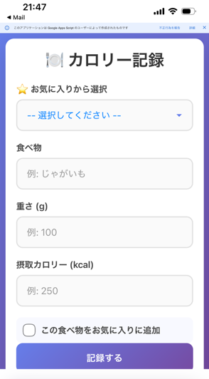
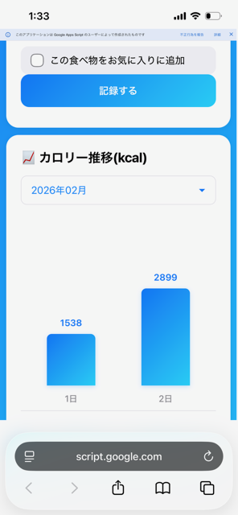
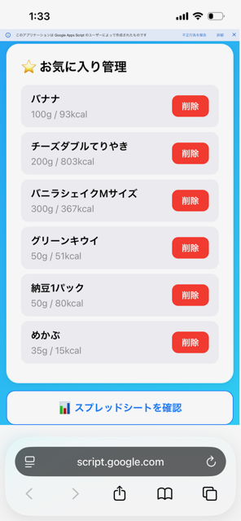

# カロリー記録アプリ

Google Apps Script (GAS) と Google スプレッドシートを使用したカロリー記録Webアプリです。スマートフォンから食事のカロリーを簡単に記録し、スプレッドシートで管理できます。

## 機能

- **カロリー記録**: 食べ物名、重さ(g)、摂取カロリー(kcal)を記録
- **AIカロリー推定**: Gemini APIを使って、テキストや写真から食品のカロリーを自動推定
- **お気に入り機能**: よく食べる食品をお気に入りに登録し、ワンタップで入力
- **月間カロリーグラフ**: 今月の日別カロリー推移をグラフで可視化
- **ダークモード**: ライト/ダークテーマの切り替え対応（設定はブラウザに保存）
- **スプレッドシート連携**: 記録データは自動的にGoogleスプレッドシートに保存
- **年月別管理**: 年ごとにスプレッドシート、月ごとにシートを自動作成

## スクリーンショット

<p align="center">
  
  
  
</p>

| 入力画面 | グラフ表示 | お気に入り管理 |
|:---:|:---:|:---:|
| 食べ物・重さ・カロリーを入力 | 今月の日別カロリー推移 | お気に入りの追加・削除 |

## セットアップ

### 1. Googleスプレッドシートの作成

Google ドライブで以下の名前のスプレッドシートを作成してください：

```
カロリー管理_2026
```

※ `2026` の部分は現在の年に合わせてください。年が変わったら新しいスプレッドシートを作成する必要があります。

### 2. Google Apps Scriptプロジェクトの作成

1. [Google Apps Script](https://script.google.com/) にアクセス
2. 「新しいプロジェクト」を作成
3. `code.gs` の内容をコピーして貼り付け
4. 「ファイル」→「新規」→「HTML」で `index` という名前のHTMLファイルを作成
5. `index.html` の内容をコピーして貼り付け

### 3. Gemini APIキーの設定（AI推定機能を使う場合）

1. [Google AI Studio](https://aistudio.google.com/) でAPIキーを取得
2. Apps Scriptエディタで「プロジェクトの設定」→「スクリプトプロパティ」を開く
3. プロパティ名 `GEMINI_API_KEY`、値にAPIキーを設定

### 4. Webアプリとしてデプロイ

1. 「デプロイ」→「新しいデプロイ」をクリック
2. 「種類の選択」で「ウェブアプリ」を選択
3. 以下の設定を行う：
   - **説明**: 任意（例：カロリー記録アプリ v1.0）
   - **次のユーザーとして実行**: 自分
   - **アクセスできるユーザー**: 自分のみ（または必要に応じて設定）
4. 「デプロイ」をクリック
5. 表示されたURLにアクセスしてアプリを使用

## 使い方

### カロリーを記録する

1. 「食べ物」に食品名を入力
2. 「重さ (g)」にグラム数を入力
3. 「摂取カロリー (kcal)」にカロリーを入力
4. 必要に応じて「この食べ物をお気に入りに追加」にチェック
5. 「記録する」ボタンをタップ

### AIでカロリーを推定する

1. 「AIで推定」ボタンをタップ
2. テキストで食品を入力するか、写真をアップロード
3. AIが食べ物・重さ・カロリーを推定し、フォームに自動入力

### お気に入りから入力する

1. 「お気に入りから選択」ドロップダウンから食品を選択
2. フォームに自動入力されるので、必要に応じて修正
3. 「記録する」ボタンをタップ

### お気に入りを削除する

1. 画面下部の「お気に入り管理」セクションを確認
2. 削除したい食品の「削除」ボタンをタップ

### スプレッドシートを確認する

1. 「スプレッドシートを確認」ボタンをタップ
2. Googleスプレッドシートが新しいタブで開きます

## データ構造

### スプレッドシート構成

```
カロリー管理_2026/
├── 202601 (1月のシート)
├── 202602 (2月のシート)
├── ...
└── お気に入り
```

### 月別シートの列構成

| A列 | B列 | C列 | G列 | H列 |
|---|---|---|---|---|
| 日付 | 時間 | 食べ物 | 重さ(g) | 摂取カロリー(kcal) |

### お気に入りシートの列構成

| A列 | B列 | C列 |
|---|---|---|
| 食べ物 | 重さ(g) | 摂取カロリー(kcal) |

## 技術仕様

- **フロントエンド**: HTML, CSS, JavaScript
- **バックエンド**: Google Apps Script
- **AI連携**: Gemini API（カロリー推定）
- **データストレージ**: Google スプレッドシート
- **対応デバイス**: スマートフォン、タブレット、PC

## ファイル構成

```
calorie-tracker/
├── images/            # スクリーンショット
│   ├── image0.png
│   ├── image1.png
│   └── image2.png
├── appsscript.json    # GASプロジェクト設定
├── code.gs            # Google Apps Script (サーバーサイド)
├── index.html         # Webアプリ UI (クライアントサイド)
└── README.md          # このファイル
```

## 注意事項

- 年が変わった際は、新しいスプレッドシート（例：`カロリー管理_2027`）を手動で作成してください
- デプロイ後にコードを修正した場合は、再デプロイが必要です
- スプレッドシートの列構成を変更すると、アプリが正しく動作しなくなる可能性があります

## ライセンス

MIT License
